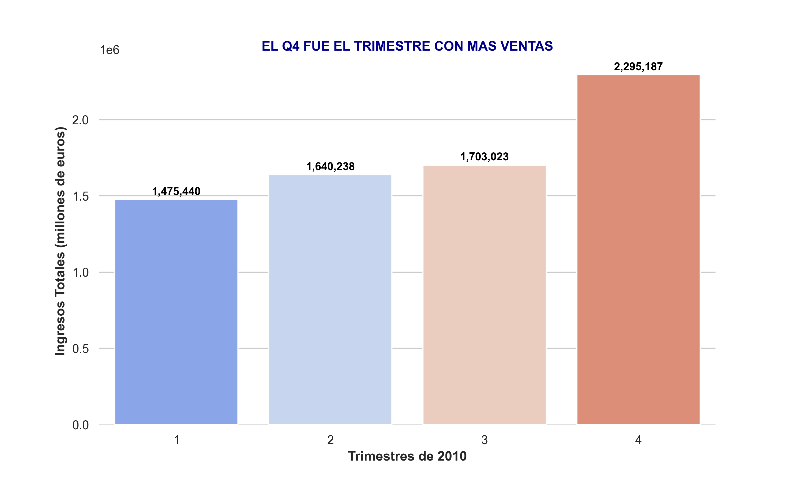
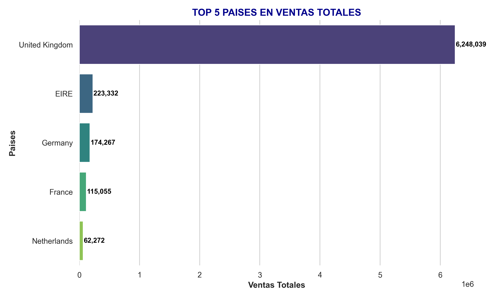
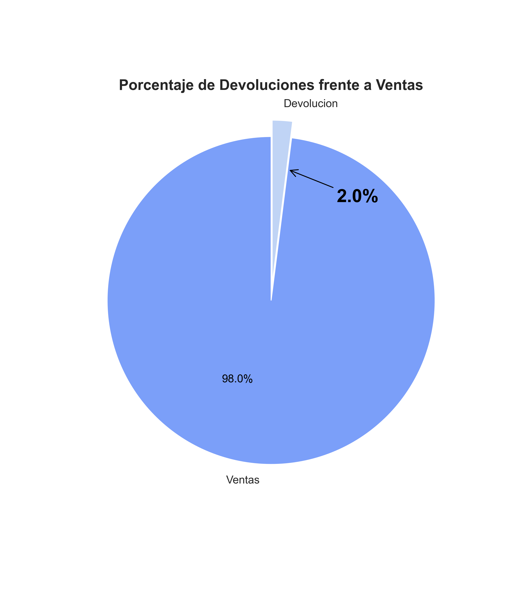

# 📊 Análisis de Datos de una Tienda Online 📈

¡Bienvenido a mi proyecto de análisis de datos de una TIENDA ONLINE! 🚀  
En este trabajo, realizamos un análisis de un dataset (+500.000 filas) para responder hipótesis específicas y visualizar patrones interesantes.

---

## 📑 **Resumen del Proyecto**

El objetivo principal de este proyecto es analizar las ventas/devoluciones de diferentes productos y países en el año marcado. Se abordan hipótesis específicas mediante un enfoque estadístico y visual.

---

## 🧐 **Hipótesis Planteadas**

### 1️⃣ **Hipótesis 1: El Q4 fue el trimestre con más ventas.**

- **Descripción**: Se analizó las ventas de cada Trimestre.  
- **Resultado**: El Q4 es el trimestre mas importante en ventas, siendo Q1-Q2-Q3 muy parejos.

#### 📊 **Gráfico**:


---

### 2️⃣ **Hipótesis 2: El Reino Unido es el país que más compra.**

- **Descripción**: Se examinó las ventas totales de cada país.  
- **Resultado**: Reino Unido es el país que más compra.

#### 📊 **Gráfico**:


---

### 3️⃣ **Hipótesis 3: Las devoluciones son un 5% frente a las ventas.**

- **Descripción**: Se calculó por separado las devoluciones y las ventas que eran (`True`) y las analizamos con el total del dataset.  
- **Resultado**: Se encontró un resultado del **2%** , una gran noticia.

#### 📊 **Gráfico**:


---

## 🛠️ **Tecnologías Utilizadas**

- **Lenguaje**: Python 🐍  
- **Librerías**: Pandas, Matplotlib, Seaborn, NumPy  
- **Entorno**: Visual Studio Code

---

## 🗂️ **Estructura del Proyecto**
```plaintext
🚀 **EDA_Tienda_Online**
│
├── 📂 **src/**                 # Contenidos
│   ├── 📂 **data/**            # Datasets
│   ├── 📂 **img/**             # Imágenes y gráficos
│   └── 📂 **notebook/**        # Jupyter Notebooks con análisis
│
├── 📝 **main.ipynb**           # Análisis final
├── 🎥 **presentacion_video**   # Video Presentación
├── 🧠 **memoria.pdf**          # Memoria del proyecto
└── 📄 **README.md**            # Archivo de documentación
```
